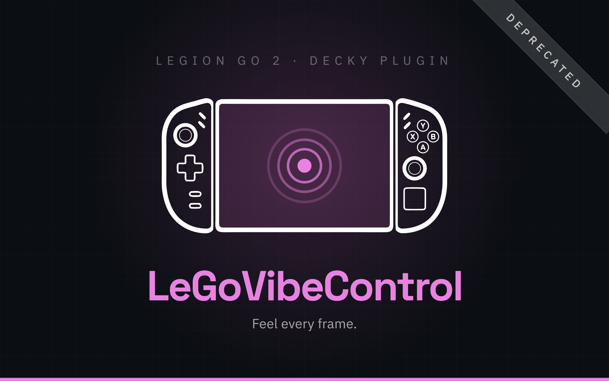

<div align="center">



[](https://github.com/Rayekkk/LeGo-Vibe-Control/releases/latest)
[](https://github.com/Rayekkk/LeGo-Vibe-Control/releases)
[](#requirements)
[](https://decky.xyz)
[](LICENSE)

**Control vibration intensity, pattern and touchpad haptics from the Steam overlay.**
Five rumble patterns, per-game profiles, and a touchpad motor that is set apart from the handles.

[Features](#features) · [Requirements](#requirements) · [Installation](#installation) · [Usage](#usage) · [How it works](#how-it-works) · [Troubleshooting](#troubleshooting)

</div>

<!-- Screenshots go here once they exist. Two columns keeps a 16:10 capture
     from swallowing the page - it renders at half width, so half the height.

| | |
|---|---|
|  |  |
-->

---

> [!WARNING]
> **Support has ended — now part of Legion Go 2 Companion.** LeGoVibeControl remains functional, but it will receive no further updates and this repository is archived as read-only. Its features are now part of [Legion Go 2 Companion](https://github.com/Rayekkk/LegionGo2Companion). On Legion Go 2, we recommend uninstalling LeGoVibeControl and switching to Companion.

## Features

| | |
|---|---|
| **Intensity slider** | Four levels: Off / Low / Medium / High |
| **Mode slider** | Five vibration patterns: FPS / Racing / Standard / SPG / RPG, applied to both handles |
| **Touchpad haptics** | Toggle and a separate four-level intensity, independent from the controllers |
| **Per-game profiles** | Override the global settings for one game; applied automatically when it starts and reverted when it exits |
| **Test button** | Fire a 0.5 s rumble so you can feel the current intensity and mode |
| **Driver status** | Green dot when the `hid-lenovo-go` sysfs endpoint is detected |
| **Persistent** | Settings are written back to the hardware on Decky startup, after resuming from sleep, and whenever the controller reconnects |
| **In-plugin updates** | Checks GitHub releases and downloads the zip for you |

---

## Requirements

| Requirement | Details |
|---|---|
| Device | Lenovo Legion Go / Legion Go 2, tested on the Legion Go 2 Z2E |
| OS | SteamOS 3.8+ / Kernel 6.18+ |
| Kernel driver | `hid-lenovo-go`, mainline since March 2026 |
| Plugin loader | [Decky Loader](https://decky.xyz) |
| Privileges | root, which the sysfs writes require |

> [!IMPORTANT]
> **Legion Go S is not supported.** Its `hid-lenovo-go-s` driver does not expose vibration
> control via sysfs (as of May 14, 2026, SteamOS 3.9).

---

## Installation

**1.** Install [Decky Loader](https://decky.xyz) if you haven't already.
**2.** Download `LeGo-Vibe-Control-x.x.x.zip` from the [Releases](../../releases) page.
**3.** In Gaming Mode, open the **Quick Access Menu** (the `…` button).
**4.** Open the Decky menu, scroll to the bottom, then **Developer → Install Plugin from ZIP**.
**5.** Select the downloaded zip.

<details>
<summary><b>Building from source</b></summary>

<br>

Requires Node.js 18+.

```bash
git clone https://github.com/Rayekkk/LeGo-Vibe-Control
cd LeGo-Vibe-Control

npm install
npm run build      # bundles src/index.tsx into dist/
npm run package    # produces LeGo-Vibe-Control-<version>.zip
```

Then install the resulting zip through Decky's **Install Plugin from ZIP**, which is the
supported path and avoids permission problems.

To copy the files directly instead, install only the runtime payload, since copying the
whole checkout would drag in `.git/`, `src/` and `node_modules/`:

```bash
DEST=~/homebrew/plugins/LeGo-Vibe-Control
sudo mkdir -p "$DEST"
sudo cp -r main.py lego_updater.py plugin.json package.json README.md LICENSE LICENSE.MIT NOTICE dist pyudev "$DEST"
sudo systemctl restart plugin_loader
```

</details>

---

## Usage

Open the **Quick Access Menu** and tap the vibration icon. Everything applies the moment you
move it; there is no apply button.

**Launch the game first, then turn on Per Game Profile.** Whatever you pick from that point
on is stored against that game and applied automatically every time it runs. Turning the
toggle back off deletes the profile and falls back to the global one.

**Silencing the handles does not silence the touchpad.** The two have separate intensity
controls, so Off on the controller slider leaves the touchpad motor where it was.

**The controller demonstrates a new pattern by itself** the moment the mode changes. That
buzz is the hardware, not the plugin adding one of its own.

**Reset to defaults** puts the active profile back to intensity Medium, mode FPS, touchpad
intensity Medium, touchpad enabled.

---

## How it works

The plugin writes to the `hid-lenovo-go` kernel driver's sysfs attributes. Device detection
uses pyudev (bundled) with a glob fallback, so no driver name is hardcoded:

```
# Controller intensity (both handles)
.../rumble_intensity                   - off | low | medium | high

# Vibration mode (both handles)
.../left_handle/rumble_mode            - fps | racing | standard | spg | rpg
.../right_handle/rumble_mode           - fps | racing | standard | spg | rpg

# Touchpad haptics
.../touchpad/vibration_intensity       - off | low | medium | high
.../touchpad/vibration_enabled         - true | false
```

The legal values for each attribute are read from the driver's sibling `<attribute>_index`
files at runtime rather than hardcoded, so a kernel update that adds a new mode shows up
without a plugin release.

> [!NOTE]
> The driver does not reliably reflect written values on read. `rumble_intensity` returns
> the value from *before* the last write, so the plugin tracks what it wrote in memory
> instead of reading back. Anything that can reset the hardware, such as resuming from sleep
> or reconnecting the controller, clears that cache and forces a full rewrite.

**Test Vibration** is the one control that does not go through sysfs. It uses the Linux evdev
force-feedback interface, picking the node whose USB vendor:product matches the detected
controller, so it cannot rumble some other pad you have plugged in.

Settings are persisted through Decky's `SettingsManager`, so they survive reinstalling the
plugin.

---

## Troubleshooting

<details>
<summary><b>Driver Status shows a red dot</b></summary>

<br>

```bash
# Check the driver is loaded
lsmod | grep hid_lenovo_go

# Check the sysfs paths exist
ls /sys/bus/hid/drivers/hid-lenovo-go/*/rumble_intensity 2>/dev/null
```

Check what you are running with `uname -r` against the versions in
[Requirements](#requirements). Below those, the sysfs endpoint does not exist at all.

</details>

<details>
<summary><b>Sliders move but vibration does not change</b></summary>

<br>

```bash
# Test the sysfs write manually
echo "medium" | sudo tee /sys/bus/hid/drivers/hid-lenovo-go/*/rumble_intensity

# Check plugin logs
journalctl -u plugin_loader | grep lego-vibe | tail -30
```

Trust the log lines rather than reading the attribute back, for the reason in
[How it works](#how-it-works).

</details>

---

## Development

```bash
npm run build       # bundle the frontend into dist/
npm run watch       # rebuild on change
npm run typecheck   # TypeScript check with no emit
npm run package     # build the release zip
```

The frontend is built with [`@decky/rollup`](https://www.npmjs.com/package/@decky/rollup),
the official Decky preset, which maps `react`, `react/jsx-runtime`, `react-dom` and
`@decky/ui` onto the globals Steam injects rather than bundling them.

`lego_updater.py` is shared verbatim with all my other plugins, change it in one repo and
copy it to the others.

CI builds every push and pull request. Pushing a tag such as `1.5.0` builds the zip and
publishes a GitHub release; the tag must match the `version` in both `plugin.json` and
`package.json`.

---

## Credits

- Kernel driver: `hid-lenovo-go` by Derek J. Clark, merged into mainline Linux
- Bundled [pyudev](https://github.com/pyudev/pyudev) is LGPL-2.1, see [NOTICE](NOTICE)

---

## License

BSD 3-Clause - see [LICENSE](LICENSE). This plugin is derived from
[Ally Vibe Control](https://github.com/piyush-tyagi-13/ally-vibe-control) by
piyush-tyagi-13; the parts inherited from it stay under the MIT License, kept in
[LICENSE.MIT](LICENSE.MIT). Provenance and third-party components are set out in
[NOTICE](NOTICE).

---

<div align="left">

*Vibe coded with the help of [Claude](https://claude.ai) 🤖*

</div>
